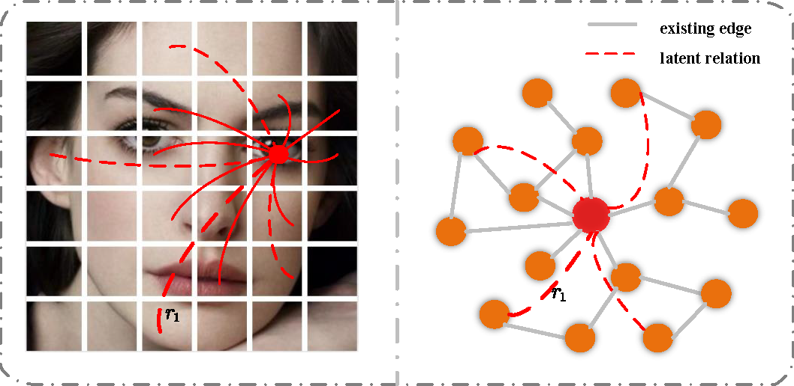
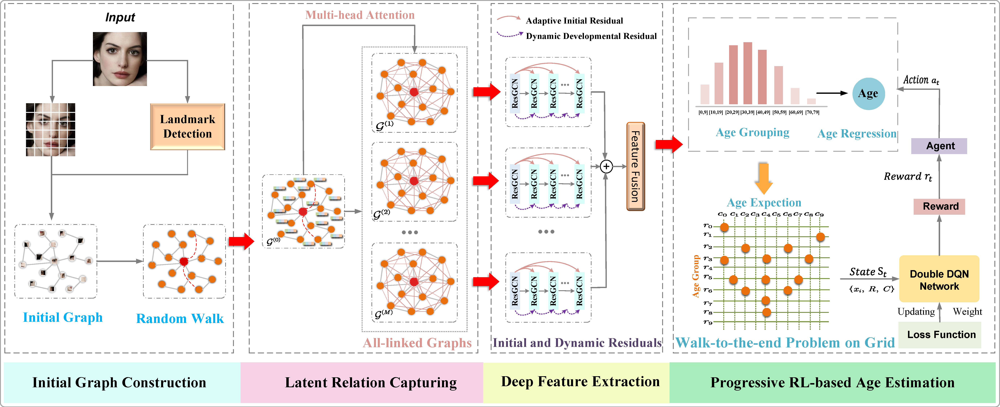

# LRA-GNN: Latent Relation-Aware Graph Neural Network with Initial and Dynamic Residual for Facial Age Estimation

> [LRA-GNN: Latent Relation-Aware Graph Neural Network with Initial and Dynamic Residual for Facial Age Estimation](./LRA-GNN/LRA-GNN.pdf)  
> Yiping Zhang, Yuntao Shou, Wei Ai, Tao Meng∗,and Keqin Li



We propose a new Latent Relation-Aware Graph Neural Network with Initial and Dynamic Residual (LRA-GNN) to achieve robust and comprehensive facial representation.

## Overview


Face information is mainly concentrated among facial key points, and frontier research has begun to use graph neural networks to segment faces into patches as nodes to model complex face representations. However, these methods construct node-to-node relations based on similarity thresholds, so there is a problem that some latent relations are missing. These latent relations are crucial for deep semantic representation of face aging. In this novel, we propose a new Latent Relation-Aware Graph Neural Network with Initial and Dynamic Residual (LRA-GNN) to achieve robust and comprehensive facial representation. Specifically, we first construct an initial graph utilizing facial key points as prior knowledge, and then a random walk strategy is employed to the initial graph for obtaining the global structure, both of which together guide the subsequent effective exploration and comprehensive representation. Then LRA-GNN leverages the multi-attention mechanism to capture the latent relations and generates a set of fully connected graphs containing rich facial information and complete structure based on the aforementioned guidance. To avoid over-smoothing issues for deep feature extraction on the fully connected graphs, the deep residual graph convolutional networks are carefully designed, which fuse adaptive initial residuals and dynamic developmental residuals to ensure the consistency and diversity of information. Finally, to improve the estimation accuracy and generalization ability, progressive reinforcement learning is proposed to optimize the ensemble classification regressor. Our proposed framework surpasses the state-of-the-art baselines on several age estimation benchmarks, demonstrating its strength and effectiveness.

## Citation

If you find this project helpful, please consider citing the our paper:
```
@article{zhang2025lra,
  title={LRA-GNN: Latent Relation-Aware Graph Neural Network with initial and Dynamic Residual for facial age estimation},
  author={Zhang, Yiping and Shou, Yuntao and Ai, Wei and Meng, Tao and Li, Keqin},
  journal={Expert Systems with Applications},
  pages={126819},
  year={2025},
  publisher={Elsevier}
}
```
